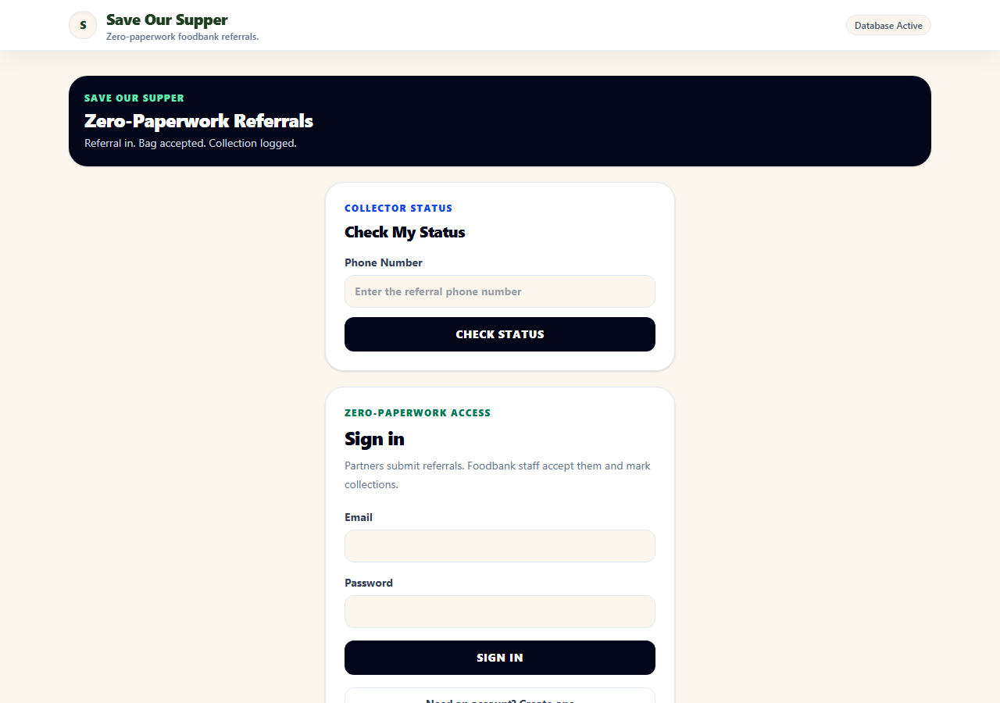
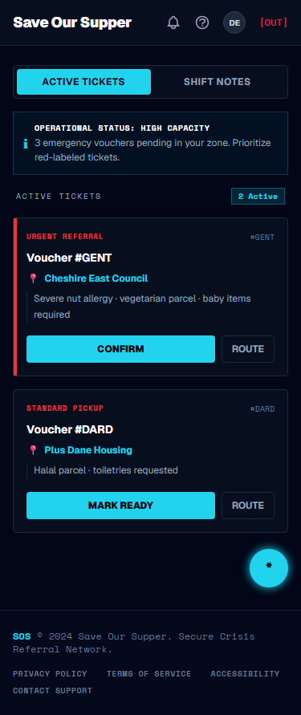

# Save Our Supper - Foodbank Referral Pipeline

Save Our Supper is a responsive, paperless foodbank referral and operations platform for Alsager & District Foodbank. It helps trusted partner agencies submit referrals, lets volunteers manage parcel status in real time, and gives admins GDPR-aware reporting and configuration tools.

**Live app:** https://save-our-supper.web.app/

---

## Screenshots

| Desktop public gateway | Mobile public gateway |
| --- | --- |
|  |  |

---

## Current Product Shape

The application is split into focused role-based experiences:

### Public Gateway

Unauthenticated users can access a clean public landing screen with:

- **Track Your Food Parcel:** a privacy-safe status checker using the phone number or email used on the referral.
- **Community Support Links:** local Cheshire East support services for mental health, debt, benefits, housing, and foodbank contact details.
- **Staff Login:** a separate entry point for approved partner, volunteer, and admin users.

The public tracker only reads a single hashed lookup document from `/public_status`. It never exposes names, phone numbers, email addresses, or referral details.

### Partner Portal

Approved partner agencies get a dedicated portal with:

- **Submit Referral Form:** captures recipient name, phone, optional email, family size, collection target, and dietary/access notes.
- **Foodbank Noticeboard:** live address, operating hours, and admin announcement from `/config/noticeboard`.
- **Agency Queue:** partners only see active referrals for their own verified `agencyId`.
- **Agency Impact & History:** anonymised completed referral history showing family size, collection date, and GDPR-archived status.

### Volunteer Dashboard

Active volunteers get the operational queue and shift tools:

- **Live Orders Queue:** accept referrals, mark parcels ready, and confirm collection.
- **Volunteer Morale Dashboard:** this-month processed referrals, families assisted, and a simple six-month trend bar chart.
- **Shift Bulletin & Handover Notes:** real-time notes for the next shift, stored in `/handover_notes`.
- **Support Directory:** same local support links available inside the logged-in workspace.

### Admin Console

Admins can access everything volunteers can, plus:

- **Monthly Reports:** GDPR-safe monthly reporting, agency breakdowns, operating-day analysis, and CSV export.
- **User Roles Manager:** approve users and assign partner, volunteer, or admin roles.
- **Manage Partner Agencies:** add or disable agencies from Firestore-backed `/agencies`.
- **GDPR & Data Retention Health:** confirms the 30-day retention standard and includes a manual purge button.
- **Noticeboard Settings:** edit public partner-facing address, hours, and active announcement.
- **Support Links Editor:** add and remove local support links stored in `/support_links`.

---

## GDPR & Privacy Model

Save Our Supper uses a two-tier privacy approach:

1. **Immediate anonymisation on collection:** when a referral is marked collected, personal fields are wiped from `live_orders` and matching public status lookup documents are deleted.
2. **Thirty-day purge:** archived records older than 30 days can be removed entirely, keeping reporting useful while minimising retained personal data.

Reports and partner history never display names, phone numbers, email addresses, or dietary notes.

---

## Firestore Collections

### `/users`

Stores account and access records.

- `uid`
- `email`
- `displayName`
- `role`: `pending`, `partner`, `active_volunteer`, or `admin`
- `agencyId`
- `agencyName`
- `requestedAgencyName`
- `createdAt`
- `updatedAt`

### `/live_orders`

Stores referral workflow records.

- `agencyId`
- `agencyName`
- `recipientName` - wiped on collection
- `recipientPhone` - wiped on collection
- `recipientEmail` - wiped on collection
- `targetCollectionTime`
- `familySize`
- `dietaryNotes` - wiped on collection
- `status`: `New`, `Accepted`, `Ready for Collection`, or `archived`
- `submittedBy`
- `createdAt`
- `acceptedAt`
- `readyAt`
- `collectedAt`
- `completedAt`
- `anonymizedAt`

### `/public_status`

Stores one-document public lookup records keyed by MD5 phone or email hashes.

- `bagStatus`
- `message`
- `updatedAt`

These records are deleted immediately when a parcel is collected.

### `/agencies`

Stores partner agency options used by admin role assignment and partner workflows.

- `name`
- `disabled`
- `createdAt`
- `updatedAt`

### `/config/noticeboard`

Stores the foodbank noticeboard shown to partner users.

- `address`
- `hours`
- `announcement`
- `updatedAt`

### `/handover_notes`

Stores volunteer/admin shift bulletin notes.

- `text`
- `createdBy`
- `createdAt`

### `/support_links`

Stores local support directory entries.

- `name`
- `description`
- `url`
- `phone`
- `category`
- `order`
- `createdAt`
- `updatedAt`

---

## Security Model

Security is enforced in `firestore.rules`:

- Public users can `get` only exact `/public_status/{key}` documents and cannot list lookup data.
- Public users can read support links.
- Partners can read and create only referrals linked to their verified `agencyId`.
- Volunteers and admins can manage operational queue records.
- Admins manage agencies, noticeboard settings, support links, users, and expired record purges.
- Volunteers and admins can read and create handover notes.
- Everything else is denied by default.

---

## Tech Stack

- React 19
- TypeScript
- Vite
- Firebase Authentication
- Cloud Firestore
- Firebase Hosting
- Tailwind CSS v4 utilities with custom glassmorphism styling

---

## ✅ Automated Testing

The project includes a `vitest` unit test suite to verify the application's core data-modeling and hashing logic:
- **Privacy Hashing:** Validates correct MD5 generation for emails (`md5EmailKey`) and phone numbers (`md5PhoneKey`) using standard lowercase-and-trim normalization.
- **Firestore Document Mappers:** Asserts accurate mappings from raw Firestore documents to `LiveOrder` and `UserProfile` objects, including default fallback logic.
- **Date & Month Helpers:** Tests correct format rendering for month-based keys and labels.
- **Access Control & Roles:** Asserts correct volunteer/staff access levels and role normalization.

To run the test suite locally:
```bash
npm run test
```

The GitHub Actions CI pipeline runs these tests automatically on every push to the `main` branch.

---

## Local Development

```bash
npm install
npm run dev
npm run build
```

---

## Deployment

```bash
npm run build
npx firebase-tools deploy
```

---

## Problems Faced & Solved

- **Privacy-safe public tracking:** instead of SMS costs or exposing referral records, the app writes small hashed lookup documents to `/public_status`.
- **GDPR reporting without personal data:** collected referrals are anonymised immediately, while non-identifying fields remain useful for reporting.
- **Role-specific complexity:** partner, volunteer, and admin users share one app shell, but Firestore rules and UI filters keep each role focused on only what they need.
- **Live configuration:** agencies, support links, noticeboard settings, and handover notes now come from Firestore instead of being hardcoded in the UI.