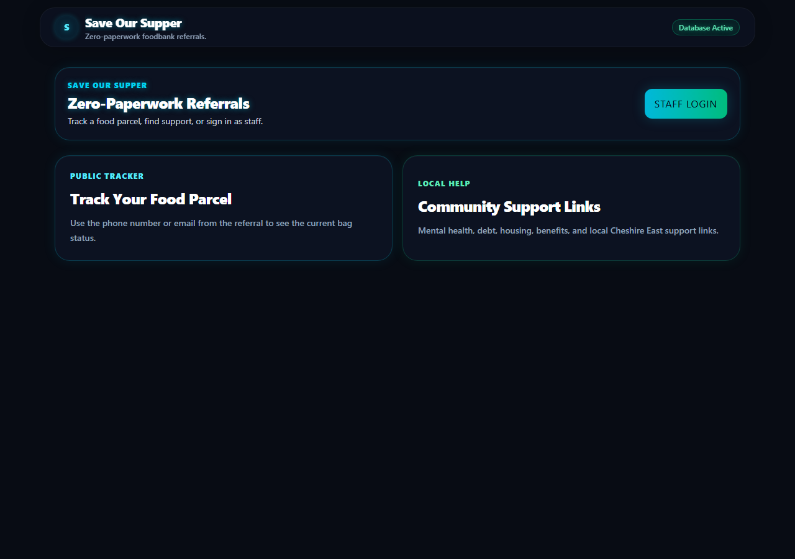
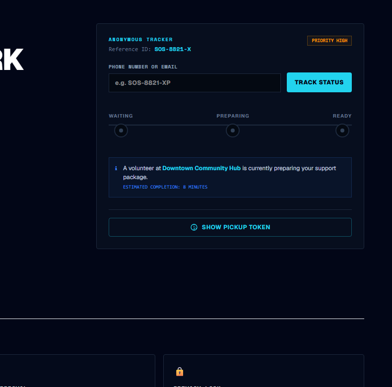

# Save Our Supper — Foodbank Referral Pipeline

> **The 1-Line Mission:** Firebase-backed digital referral and operations dashboard streamlining food parcel workflows and securing client privacy for local charities.

🔴 **Live Demo:** [save-our-supper.web.app](https://save-our-supper.web.app)

---

## 🎨 Neo-Obsidian Cyberpunk Design System
The user interface has been fully migrated to a premium **Neo-Obsidian Cyberpunk** visual specification, featuring:
*   **Colors**: Deep dark neutral page backgrounds (`#020617`), vibrant Cyan primary (`#22D3EE`), bright Blue secondary (`#3B82F6`), Teal tertiary (`#5EEAD4`), and slate dividing lines.
*   **Typography**: Clean `Geist` sans-serif for content/controls and `Space Mono` for monospace labels, codes, and tickers.
*   **Geometry**: flat panels, thin cyber borders, and restrained glows restricted strictly to primary actions and active states.
*   **Mobile-First Rail Layout**: Unified bottom navigation bar for mobile viewports (`Refer`, `Vouchers`, `Portal`).

---

## 🎥 UI Showcase & Screenshots

### 1. Public Zero-Paperwork Gateway
> Exposes the anonymous parcel tracker and local support directory without requiring user credentials.
*   **Desktop Layout**: 44%/56% split panel containing the tagline, statistics (`12k+` and `< 15min`), and the anonymous lookup status card.
*   **Status timeline**: Features step indicators that transition from horizontal (desktop) to vertical (mobile), tracking Waiting (electric blue), Preparing (amber), and Ready (neon green). Includes volunteer assignment notes and the pickup token button.




---

### 2. Partner Agency Portal
> Gated portal for approved referrers to submit client data and check notices.
*   **3-Step Wizard**: Steps (`Household` → `Immediate Needs` → `Logistics`) containing legal name inputs, case references, adult/children count selectors, and vulnerability scan checklists.
*   **Operational Rails**: Sidebar menus containingnoticeboard announcements and active client lists.


---

### 3. Volunteer Ops Center
> Kitchen-display terminal for foodbank logistics teams.
*   **Intake Tickets**: Real-time incoming tickets with priority labels (Urgent, Standard, Completed, Pending Help), ETAs, and status controllers (Accept, Ready, Collected).
*   **Handover Bulletin**: Sticky-note bulletins for shift handovers (Morning Shift, Announcement, Inventory Alert) that alternate visual rotation for an analog post-it feel.


---

### 4. Admin Security Console
> Infrastructure integrity and access panel for foodbank admins.
*   **User Role Approvals**: Pending registration approval tables with initials avatars and reject/approve actions.
*   **GDPR Data Purge**: Compliance threshold sliders, critical threshold warnings, and execute purge buttons.
*   **System stats**: Statistics widgets monitoring session count, login attempts, and database access loads.
*   **Expandable Drawer**: Advanced configurations (roles editor, agencies, support links) tucked into a collapsible settings register.

---

## ⚙️ Core Architecture & Features
*   **Public Tracking Gateway**: Anonymous status lookup using phone/email matching hashed document lookups from the `/public_status` collection to protect identities.
*   **Role Gates**: Restricts read/write operations by user role (`pending`, `partner`, `active_volunteer`, `admin`) using strict Firestore rules.
*   **GDPR Purge Workflow**: Anonymises name, phone, and email immediately upon collection. Retains statistical data while purging archived records older than 30 days.

---

## 🛠️ Local Development Setup

1. Configure local environment properties in `.env.local` (see `.env.example`).
2. Install npm dependencies:
   ```bash
   npm install
   ```
3. Run the development server:
   ```bash
   npm run dev
   ```
4. Run automated rules tests using the local Firestore Emulator:
   ```bash
   npm run test:rules
   ```
